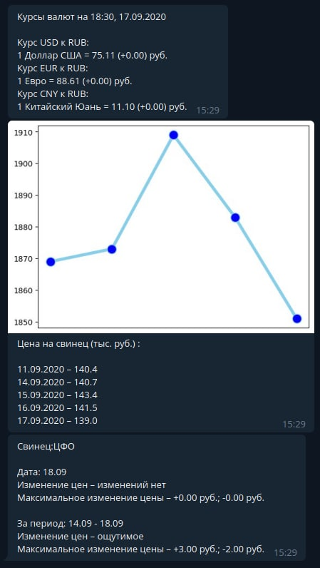

Очень старый бот, делал в сентябре 2020 года

Бот мониторит цены на металлы и составляет статистику, рисует графики

Рассылка 2 раза в день с понедельника по пятницу

Запуск парсинга и отправки результатов в телеграме реализован через cron, вызывается функция send_messages и в ней всё делается

Через @bot.message_handler принимаются команды старта бота от пользователей и добавление их в базу (в функции add_user сначала идет проверка, нет ли пользователя в базе уже)

